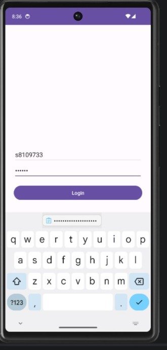
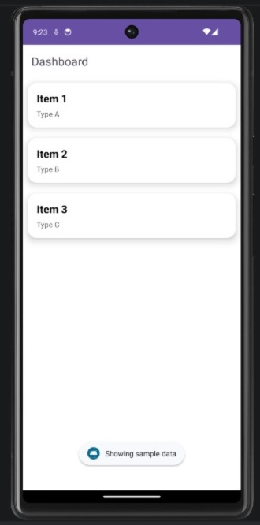
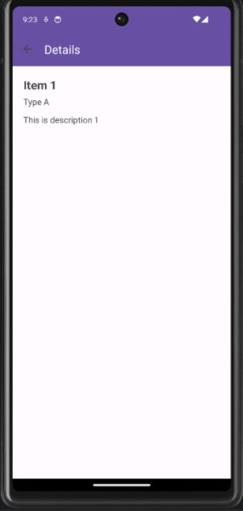

# 📱 NIT3213 Data Viewer App

## 📌 Overview

The **NIT3213 Data Viewer App** is an Android application developed using modern Android development practices.
It allows users to authenticate, view structured data in a dashboard, and navigate to detailed views.

The project demonstrates the use of **MVVM architecture, Dependency Injection, API integration, and Unit Testing**.

---

## 🚀 Features

* 🔐 User Authentication (Login API)
* 📊 Dashboard displaying dynamic data (RecyclerView)
* 📄 Detailed view for each item
* 🔙 Smooth navigation between screens
* ⚙️ MVVM Architecture (ViewModel + LiveData)
* 🔗 API Integration using Retrofit
* 💉 Dependency Injection using Koin
* 🧪 Unit Testing using JUnit

---

## 🏗️ Architecture

This project follows the **MVVM (Model-View-ViewModel)** architecture:

* **Model** → Data classes (`Entity`, API responses)
* **View** → Activities (`MainActivity`, `DashboardActivity`, `DetailsActivity`)
* **ViewModel** → Handles business logic and data preparation

This ensures:

* Separation of concerns
* Improved maintainability
* Better testability

---

## 🛠️ Technologies Used

| Technology     | Purpose                   |
| -------------- | ------------------------- |
| Kotlin         | Core programming language |
| Android Studio | Development environment   |
| Retrofit       | API communication         |
| Koin           | Dependency Injection      |
| RecyclerView   | List UI                   |
| LiveData       | Reactive UI updates       |
| ViewModel      | State management          |
| JUnit          | Unit Testing              |

---

## 🌐 API Details

Base URL:

```
https://nit3213api.onrender.com/
```

* Login endpoint used for authentication
* API follows a **link-based (HATEOAS-like)** structure
* Sample data is used where API response is limited

---

## ▶️ How to Run the Project

1. Clone the repository:

```
git clone https://github.com/mukeshsapkota/NIT3213-DataViewer.git
```

2. Open in Android Studio
3. Sync Gradle
4. Run the app on emulator or physical device

---

## 📸 Screenshots

### 🔐 Login Screen



### 📊 Dashboard



### 📄 Details Screen



---

## 🧪 Unit Testing

Unit testing is implemented using **JUnit**:

* ✔ Entity model validation
* ✔ ViewModel data handling test

This ensures correctness of application logic.

---

## 📚 Key Learnings

* Implementing MVVM architecture in Android
* Using Koin for dependency injection
* Handling API responses and limitations
* Writing unit tests for better code quality
* Managing version control using GitHub

---

## 👨‍💻 Author

**Mukesh Sapkota**
Student ID: s8109733

---

## ✅ Project Status

✔ Completed
✔ Fully functional
✔ Ready for submission

---
